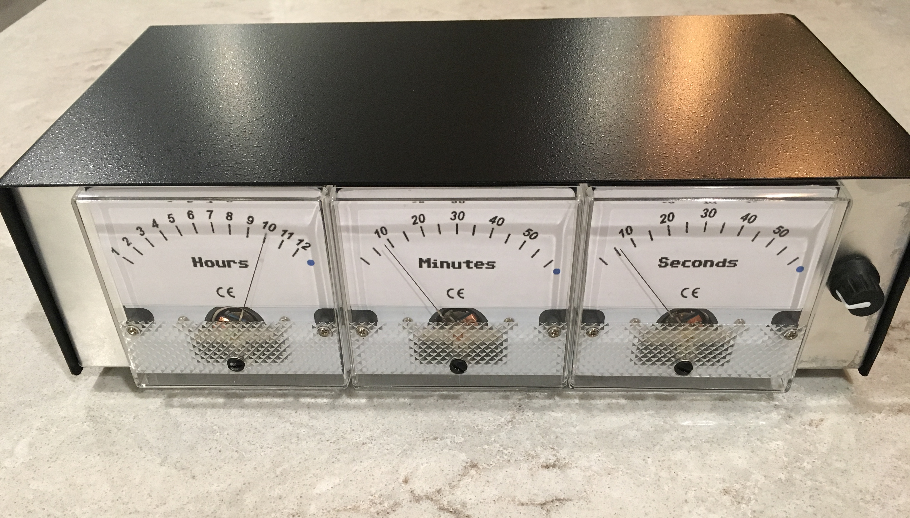

# Panel Meter Clock

This project uses the LoPy microcontroller to control the clock and uses analog panel meters to display the time.  The clock's time can be set by using the control knob on the front of the panel or by using a built-in web page.

### Operation
To set the time using the front panel button:

* Press the button to start enter into set time mode
* Using the dial set the hour
* Press the button to set the minutes
* Press the button to set the seconds
* Press the button to exit and set the time

To set the time using a browser:

* Connect to the wifi access point named `Panel Meter Clock`
* Enter in the '.1' of your connected IP address.  For example, if your IP address is 192.168.4.2, in your browser enter in the URL `http://192.168.4.1`.
* Use the on-screen controls to manually adjust the time or use the `Set Time to Now` button to set the time using computer's current time.

### Time API
Use can also set the time by using the Time API from the command line or browser.

`/ignored?hour=<24-hour-time>&minute=<0-59>&second=<0-59>`

Any of the parameters can be dropped.  If there are no valid parameters, the default web page [index.htm](lopy/index.htm) will be returned and the time will remain unchanged.

Example: `curl "http://192.168.4.1/ignored?hour=5&minute=30&second=20"`

